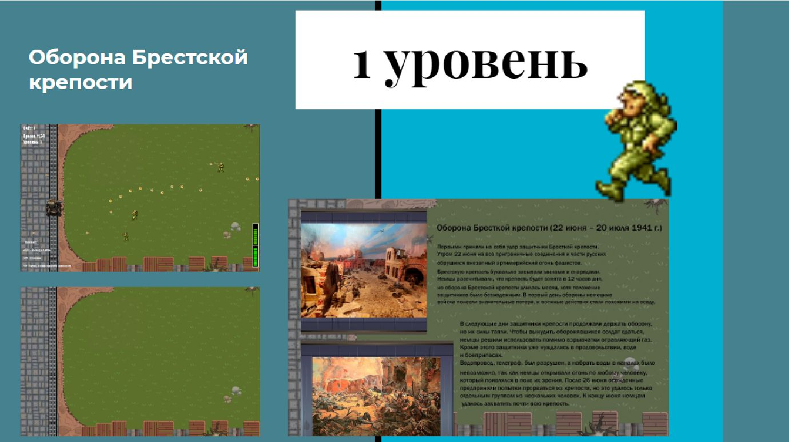
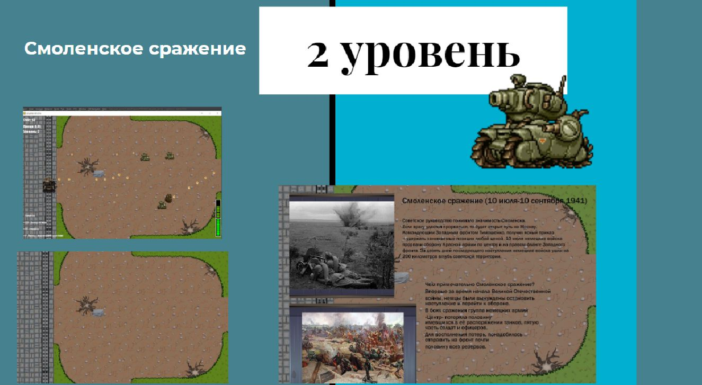
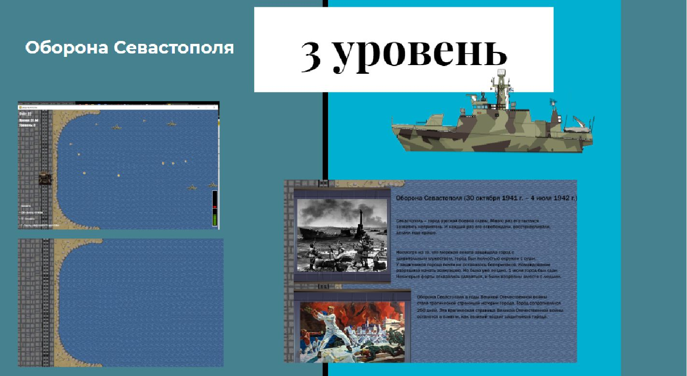
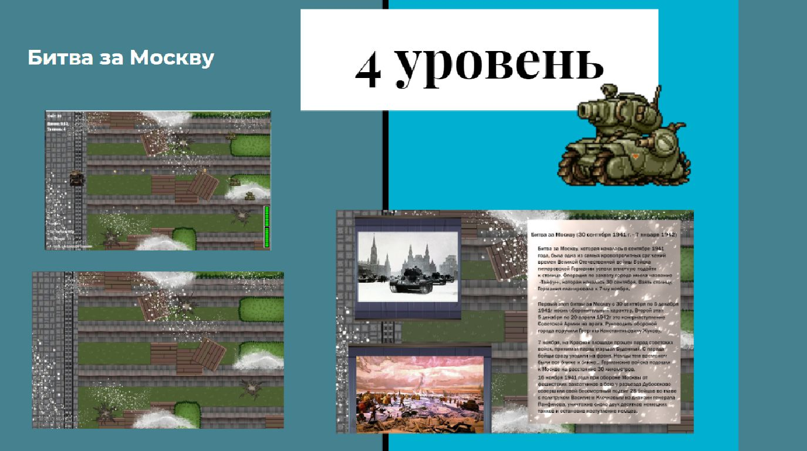
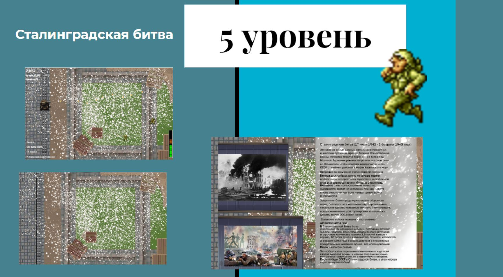
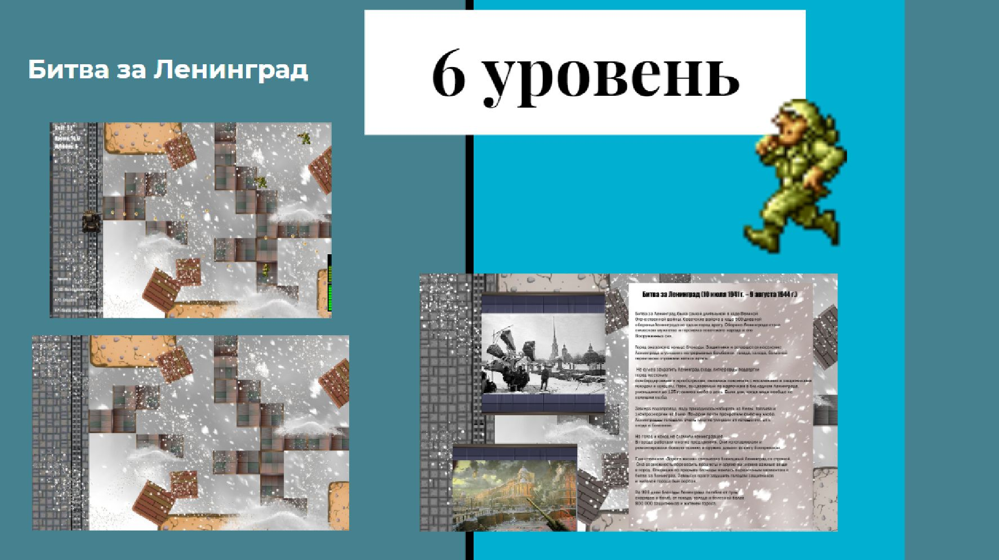
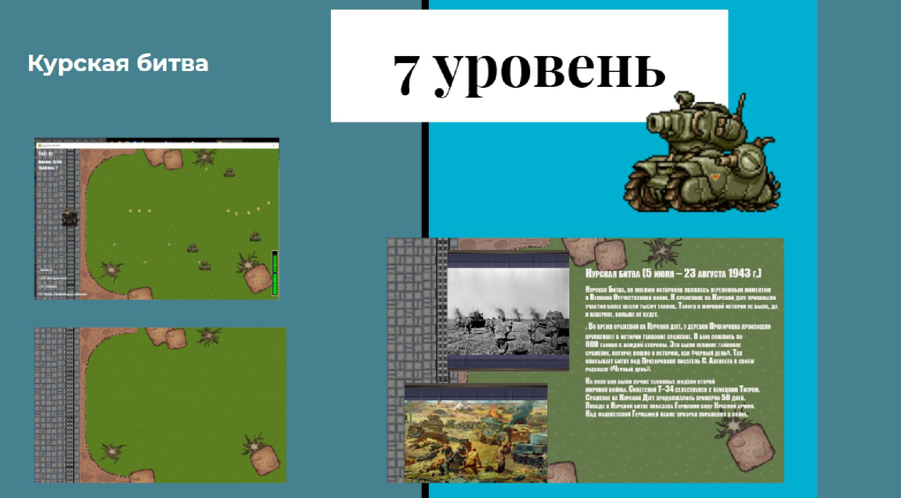
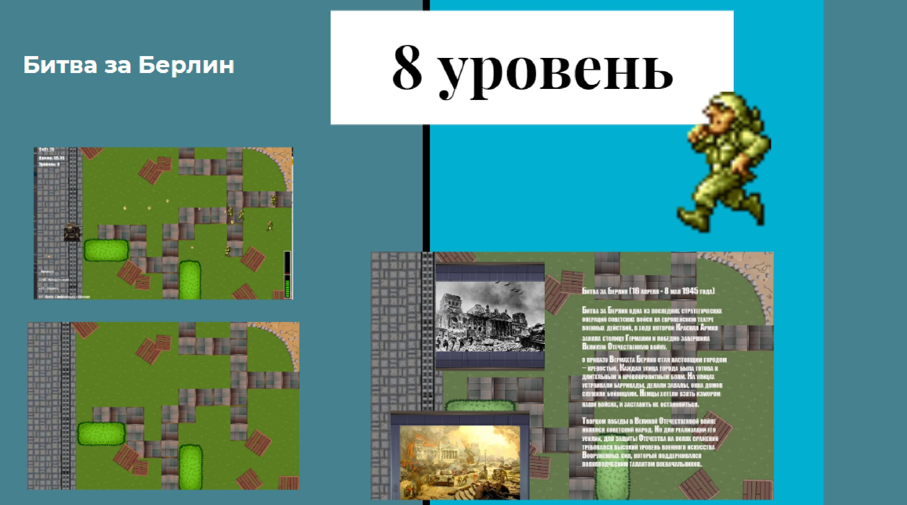

# На защиту с историей
    Игра посвящена 75-летию Великой Отечественной войны
    Создана в рамках хакатона "Живая память"
    Направление - Создание интерактивного образовательного контента,
    посвященного Великой Отечественной войне

### Введение
В 2020 году весь мир празднует 75-летие ВОВ. В честь такого праздника, по всему миру проходят соревнования, и мы не стали исключением.
 
 Цель моей работы является создание образовательного контента - игры, которая будет призывать следующие поколения к сохранению памяти о событиях одной из самых страшных войн в истории, но в тоже время, самой патриотичной  и одухотворенной войной.

### Аннотация
За 3 дня мне удалось создать развлекательную игру с образовательным содержанием. А именно:
+ Систему уровней, хронологически построенную по событиям ВОВ.
+ Каждый уровень оснащен информацией о событии.
+ Пользователь не только хорошо проводит время с развлекательным контентом, но и получает базовые знания о сражениях.
+ На каждом уровне представлены различные локации, это помогает визуально запомнить место сражения.

### Цель игры
Убить n врагов и не дать им дойти до своей базы (она находится за пушкой), дойти до конца уровней 

И конечно не умереть самому =)
### Управление
- Пользователь может управлять пушкой используя клавищи PgUp (W), PgDown (S). Перемещение пушки возможно лишь в 2 направлениях.
- Стрелять можно при помощи клавиши Space (Приятный бонус =) Если зажать пробел, то пули будут вылетать плавно)
- С помощью клавиши F1 можно прочитать краткую справку о текущем сражении (уровне).
- С помощью клавиши F2 можно увидеть краткие подсказки по управлению
- C помощью клавиши P можно поставить игру на паузу.
- С помощью клавиши N можно начать игру заново

### Примечание
+ Жизненная энергия кончается, но не возобновляется
+ Количество пуль возобновляется

### Автосохранение
Игра автоматически сохраняет текущий прогресс и при последующем запуске вы сможете продолжить там,
где закончили. Удалить сохраненную игру можно, нажав кнопку N (новая игра).

### Основное содержание

Видео отрывка игры находится в главной директории проекта, обязательно к просмотру! 

### Запуск игры
    Игра написана под версию Python 3.7
    Python 3.8 еще не поддерживает pygame скачайте python 3.7.x 
    и все будет нормально установлено. Ссылка на python 3.7.5
    -- https://www.python.org/downloads/release/python-375/ - последняя релиз версия 3.7
Просто перейдите в файл main.py и запустите его =)

### Заключение
Во время хакатона мне удалось написать игру с нуля на языку Python, с использованием фреймворка Pygame. Игра нацелена на детей в возрасте от 7 до 18 лет, а также на тех, кто не знает базовые сражения ВОВ. Провести время весело можно! Изучайте историю! Вам она всегда пригодится, многие решения настоящих и будущих проблем можно найти в прошлом, просто учитесь, и все получится!

### Список сайтов и программ
1. Интернет-ресурсы (Wikipedia, Яндекс фото, Яндекс)
2. Программы:
   - Adobe Photoshop 2020
   - IntelliJ IDEA  2019.3.2
   - GitHub
   - SQLiteStudio

